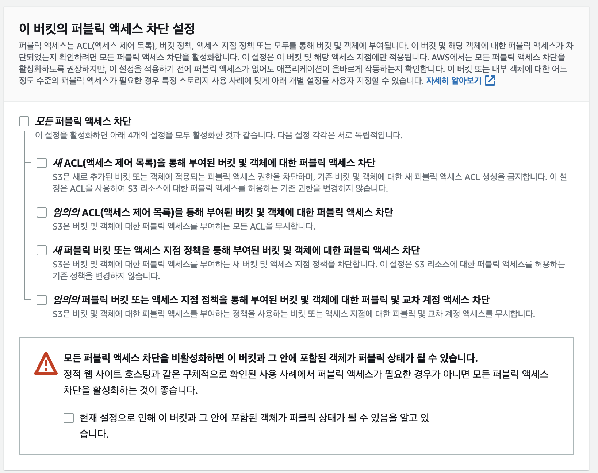
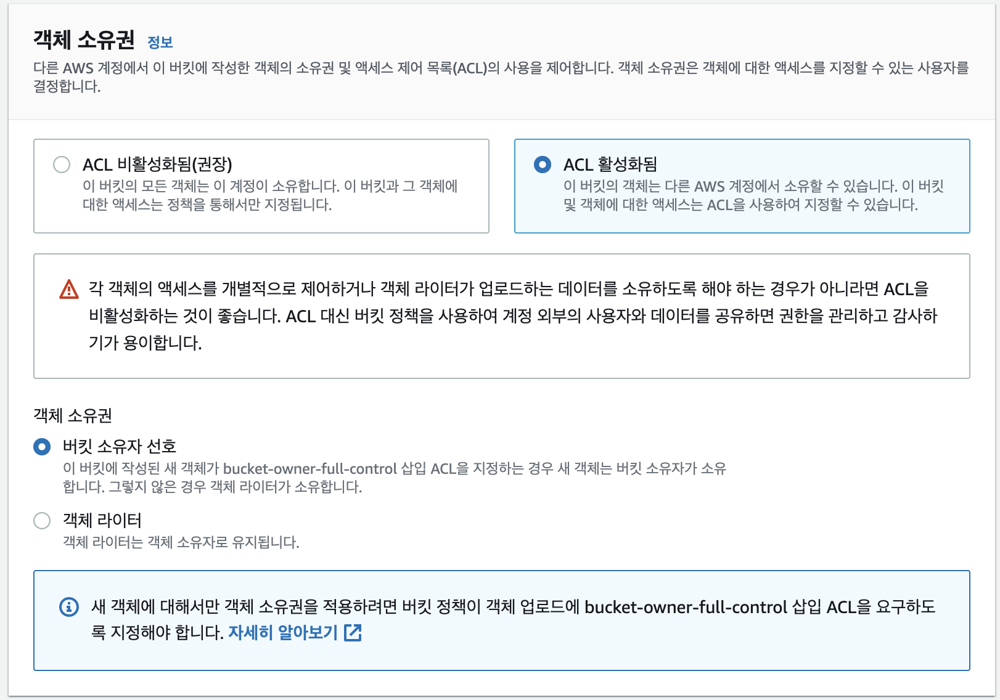

# NoGwari Apply S3

---------------------

NoGwari에서 게시글을 작성할때, 솔직히 text만 있는 게시글이면 재미없으니까 이미지를 추가하고자 하였다. 여러가지 툴들을 요리조리 찾아보다가  어떻게 해야할지 감이 안오길래 카카오톡 nodejs 오픈채팅방에 질문을 하였다. 진짜 친절하게도 여러분들이 답변해주셨는데, 이런 거 진짜 다 처음봐서 엄청 신기했고, 감사했다. 감사합니다.


**도와주셨던 분들 감사합니다...**

이제 생각하는게 조금 다르셨다. "S3가 제일 좋을 거 같은데요?"라는 대답을 원했는데 "S3가 제일 재밌을 거 같은데요?"라고 하시길래 와.. 다들 진짜 찐 개발자구나... 다들 재밌구나... 싶어서 놀랐었다 ㅋㅋㅋ 여튼 이러한 배경으로 S3를 구축하였다.

우선 S3사이트에 가서 버킷을 생성해주었다.

그냥 사이트가서 만들기 해주면 되는데, 주의해야할 점이 있다. 아래 사진에 있는 모든 퍼블릭 액세스 차단을 풀어주는 것이다. 



그리고 객체 소유권에대한 옵션도 아래와 같이 바꿔주었다.



나중에 알았는데, ACL 비활성화를 시켜두면 내 로컬환경에서도 The bucket does not allow ACLs라는 오류로 버킷에 이미지가 등록이 안되기 때문에, 만들때부터 옵션을 이렇게 두는게 좋을 거 같다.

그 후, aws S3에 접근하기 위해선 **accessKey**와 **secretAccessKey**라는 녀석이 필요하다. 그래서 IAM에서 사용자그룹과 사용자를 만들어주었는데, 어 이걸 뭐라해야할까,,, 내가 이해한바로는 그렇다.

IAM은 우선 임의의 사용자를 만드는 기술이다. 어떤 정책이나 어떤 보안등을 관리하게 위해서 말이다. 

그래서 IAM에 들어가 사용자를 만들다보면 


이와 같은 옵션이 있다. 음.. 예를 들어서 설명을 해보자

한 공장에서 기계 A, B, C가 있고, 사람 a, b, c가 있다고 해보자. 각각의 기계는 권한이 있는 사람만 작동시킬 수 있다고 가정하자.
만약 내가 사장이라면 기계 A에 대해 사람 a, b에게 따로 일일이 권한을 줄 수 있다. 이게 저 사진에 있는 ""직접 정책 연결""이라는 탭이다.
그리고 사용자 c에게 이렇게 a, b처럼 일일이 권한주기 귀찮으니까 c한테 a나 b보고 따라해! 라고 한다면 "권한 복사"라는 탭이고, 
이렇게 하다보니까 헷갈려서 사람 a, b를 사용자그룹으로 묶을 수 있다. 사용자 그룹으로 묶어서 이 그룹은 기계 A할 권한이 있어! 라고 정해준다면, 이게 맨 왼쪽에 있는 "그룹에 사용자 추가"버튼이다. 

지금 S3의 경우 내 생각에는 굳이굳이 나 혼자 개발하는데 사용자 그룹을 만들 필요는 없었다. 그치만 이미 만들어버렸고, 그 그룹안에서 정책을 추가해주었고, 저 맨왼쪽 탭인 "그룹에 사용자 추가"를 이용하여 IAM을 설정해주었다.

이거 읽다보면 '정책? 정책이 뭔데?'라고 생각하는 사람이 있을거다. 정책은 앞서 예시에서 말했던 기계에 대한 권한 같은 것이다. 만약 사용자 그룹을 만들고, 그 그룹안에 사용자를 넣는 방법이라면 사용자 그룹을 만들면서 권한 정책을 넣는 페이지가 있을것이고, 사용자에게 직접 권한을 연결해준다고 하면


IAMFullAccess라는 건 하는 사람도 있고 안하는 사람도 있어서 잘 모르겠지만 **AmazonS3FullAccess**라는 애는 무조건 권한을 부여해줘야하는 거 같다.

이렇게 하면 필요한 AccessKey가 발급되는데, 그 값들도 약간 비밀느낌이니까 .env에 넣어주고 아래와 같이 multer을 사용하여 S3를 설정하였다.

```javascript
import multer from "multer";
import multerS3 from "multer-s3";
import {S3Client} from "@aws-sdk/client-s3";
import shortId from "shortid";
import {config} from "../config.js";

export const upload = multer({ //
    storage: multerS3({
        s3: new S3Client({
            credentials: {
                accessKeyId: config.aws.accessKey,
                secretAccessKey: config.aws.secretAccessKey,
            },
            region: "us-east-2",
        }),
        bucket: "nogwari",
        acl: "public-read-write",
        contentType: multerS3.AUTO_CONTENT_TYPE,
        key: function (req, file, cb) {
            const fileId = shortId.generate();
            const type = file.mimetype.split("/")[1];
            const fileName = `${fileId}.${type}`;
            cb(null, fileName);
        },
    }),
});

```

우선 shortId라는 친구도 추가해주었는데, fileName을 만들때 임의의 값을 넣어주기 위하여 해주었다.
저기 코드 주석 앞에있는 upload라는 multer라이브러리안에 들어있는 것이고, 지금 미들웨어로 코드를 짰다. 그래서 저렇게 upload하는 과정을 만들어주고, router에서 아래와 같이 호출해주면 된다. 

```javascript
router.post("/upload", upload.single("image"), boardController.newPosting);
```

upload할때 나는 테스트용으로 하였기에 single을 사용하였지만, 여러 옵션이 있다.

| single    | 이미지 하나만                                                |
| --------- | ------------------------------------------------------------ |
| **array** | 여러가지 이미지를 업로드할때 배열로 결과값을 뽑아줌          |
| **field** | 한번에 여러개를 업로드하는 것이 아닌, 따로따로 하나하나 업로드를 해줘야한다면 |

이렇게만 해주면 S3연동 끝!
IAM에 대해서 공부하는 시간이 더 많았던 거 같고, S3는 생각보다 쉽게 연동되었던 거 같다. 기부니 좋구만유 

밑에 참고사이트를 걸어두었으니 내거가 이상하다고 생각되면 저거 보면 된다. 저 분이 더 잘쓴 거 같기도...ㅎ

[참고 사이트]

[참고 사이트]: https://velog.io/@fud904/AWS-multerS3-%EC%82%AC%EC%9A%A9%ED%95%B4%EC%84%9C-%EC%9D%B4%EB%AF%B8%EC%A7%80-%EC%97%85%EB%A1%9C%EB%93%9C%ED%95%98%EA%B8%B0
