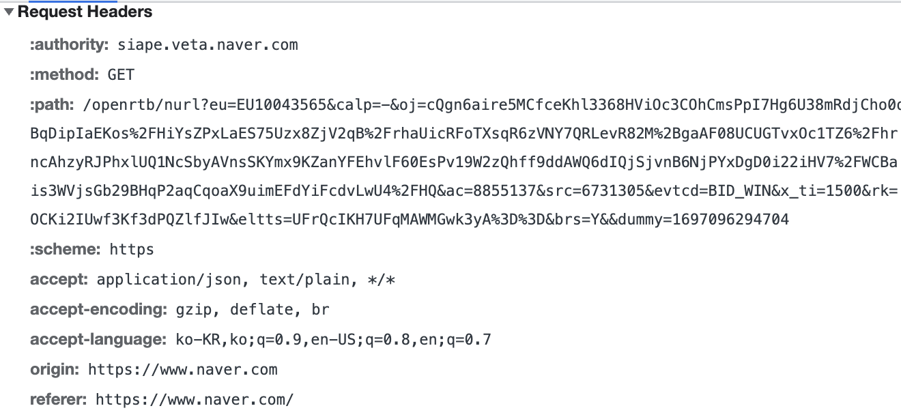
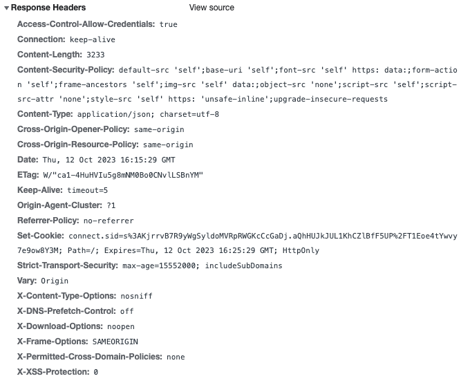

# CORS

---

안녕하세요 반갑습니다.

오늘은 CORS에 대해 이해한 내용을 정리해보려고 한다.
이게 참 오묘한 친구라고 생각한다. 분명 완벽히 이해했다고 느꼈음에도 다음번에 다시보면 또 새로운 내용같다.
이거 반복인 거 같다. 이해했다고 느꼈는데 ~ 다시 보면 또 새롭고 ~ 또 이해했다고 느꼈는데 ~ 다시 보면 또 새롭고 ~

이게 싫어서 오늘은 진짜 완벽하게 이해했다는 느낌으로다가 정리해보려고 한다.

CORS는 보통 뻐어어얼겋게 뜬다. 그래서 CORS 에러라고들 많이 부르는 거 같다. 근데 이게 굳이 따지자면 그게 아니라고 생각한다.

CORS는 Cross-Origin Resource Sharing의 약어이다. 한글로는 교차 출처 자원 공유? 정도인데, 말이 어렵지만 결국 서로 다른 출처에서의 자원 공유를 뜻하는 것이다.

그렇다면 출처는 무엇인가?


그냥 인터넷에 게시되어있는 URL사진을 가져왔다.

이 사진에서 Origin, 즉 출처는 **Scheme, Domain Name, Port**까지 3가지를 합쳐 Origin이라고 한다.

그럼뭐냐, CORS라는건 저 세가지의 값이 다른 출처끼리의 자원공유를 뜻한다.

좋다 그럼 이제 CORS가 어떤 녀석인 지 알았으니 CORS에러를 한번 살펴보자


인터넷에서 cors에러 치자마자 맨 위에 뜬 녀석을 가져온 사진이다. 위의 에러를 간단히 번역해보면 어떤 주소(Origin, 출처)에 대해서 CORS정책에 의해 차단되었다고 한다. 그니까 결국 교차 출처 자원 공유가 안된다. 라는 소리다.

왜 안되냐? 막아뒀다.

브라우저는 원래 공격에 취약하다. 만약에 CORS정책이 없다고 가정해보자.

1. 착한 사용자 진성이가 있다. 진성이는 친구한테 더치페이 하기위해서 우리은행에 접속되어 있다.
2. 착하지만 멍청한 사용자 진성이는 우리은행을 다른 탭에 켜놓고(브라우징 된 상태에서) 악의적인 웹사이트인지도 모르고 어떤 사이트에 접속한다.
3. 악의적인 웹사이트를 개발한 개발자가 악성 JS코드를 담아놓았다.(악성 JS코드란, 우리은행에게 요청을 보내는 코드같은 것이다.)
4. 웹사이트에서 JS코드가 실행되어 내 우리은행 통장에서 악성 개발자의 통장으로 이체를 요청한다.
5. 우리은행은 멍청한 진성이가 더치페이하는 줄 알지, 악성 개발자 통장에 돈 뜯기고 있는지는 알리가 만무하다.
6. 그래서 우수수 보내버린다.
7. 😢

이게 CORS정책이 존재해야하는 이유이다. CORS정책이 있기때문에 악의적인 웹 사이트에서 다른 웹사이트(예: 은행 웹사이트, 소셜 미디어, 이메일 서비스 등)에 요청을 보내지 못하는 것이다. 이것때문에 에러나서 화내면 못난 사람이다.

그러면 어떻게 해요!! 라고 한다면 다음의 코드와 같이 작성하면 된다.

```javascript
// npm i cors

import cors from "cors";

const corsOption = {
    origin: ["http://examsite.com", "http://localhost:3000"], // *
    optionsSuccessStatus: 200, // some legacy browsers (IE11, various SmartTVs)
};

app.use(cors(corsOption));
```

우선 cors package를 인스톨해주고, 위와 같이 작성하면 된다. 단, origin부분은 원하는 출처를 걸어주는 것이다. 나같은 경우는 프론트엔드 개발환경을 허락해주기위해서 http://localhost:3000은 풀어준 상태이다. 저것도 원래 굉장히 위험한 것이다. 그냥 저런 문자열 값 origin을 걸어준다면 누군가 그냥 3000포트로 실행시켜서 내 사이트에 요청을 보내면 다 허락해준다. 실제 운영되는 시점에서는 빼줘야하는 부분이다.

그리고 주석처리되어있는 "\*"은 모든 출처에서 허락해준다는 얘기이다. 개발단계에서만 쓰자. 저건 더더욱 위험하다.

오케이 CORS를 설정하는 방법을 간단히 배워봤으니 다시 이론으로 돌아와 **SOP**에 대해 설명해보겠다.

CORS가 더 유명인사긴 한데, **SOP안에 CORS가 있는 것이다.**

SOP는 Same-Origin Policy의 약어이다. 동일 출처 정책으로, 동일한 출처일때! 만 리소스 공유가 가능하다는 것이다. 근데 이것을 반드시 지킨다면 세상은 지금보다 굉장히 퇴보되어있을거다. 왜냐, 현재 배달의 민족이라는 큰 기업도 한국의 지도를 가져올때 본인들이 구현하지않고 구글지도, 네이버지도 API를 따와서 쓴다. 기술적으로 안되는 게 아니라, 분단국가 특성상 몇몇기업에게만 지도 API가 제공된다는 점은 있긴 하지만, 여튼! API를 따와서 쓰는 경우는 굉장히 많다. 서로 만든것을 공유한다는 뜻이다.

근데 이런 과정에서 SOP정책을 반드시 지켜야한다면 외부 API를 끌고오는게 불가능하다. 그래서 만들어진게 CORS다.

CORS라는 정책에서는 출처의 예외값을 받는다. 동일 출처가 아니더라도, 내가 허락한 출처에서는 리소스를 공유해준다는 얘기이다. 그렇기 때문에 우리가 쉽게 네이버 카카오 API를 쉽게 받아서 쓸 수 있는 것이다. 우리가 신청하는 순간 우리가 만든 출처에 대해서 CORS를 풀어주는 것이기 때문이다.

그렇다면 마지막으로, **CORS오류인지 어떻게 판단하는지**에 대해 설명해보겠다.

예시를 들기 위해 네이버에서 요청헤더와 응답헤더를 봐보자.




다 볼 필요 없다. 응답 헤더에서 access-control-allow-origin과 요청헤더에서 origin값만 확인하면 된다. 똑같지않은가? 이는 SOP가 통과하는 예시이다.

다음 예시는 **8080포트에서 서버를 띄우고, 3000포트에서 클라이언트와 연결**하려고 했을때이다.

서버에서의 CORS설정은 아래 코드와 같다.

```javascript
import cors from "cors";

const corsOption = {
    origin: ["http://examsite.com"]
    optionsSuccessStatus: 200,
};

app.use(cors(corsOption));
```

그럼 3000포트를 화이트리스트에 걸어주지 않았기 때문에(origin의 배열값안에 안 넣어줬기 때문에) 당연히 CORS 정책을 위반했다는 오류가 출력될 것이다. 여기서의 응답 & 요청 헤더를 확인해보자.




요청 헤더에서 Origin의 값은 3000포트로 띄운 프론트엔드임을 확인할 수 있다. 하지만, 응답 헤더에서 있어야 할 access-control-allow-origin의 값 자체가 존재하지 않음을 볼 수 있다. 아예 출력되지않는 이유는 잘 모르겠으나, 여튼 같은 출처도 아니면서, CORS정책을 풀어주지도 않으니 에러가 출력되는 것을 볼 수 있다.

그러므로, CORS에러임을 가장 간단히 확인할 수 있는 방법은

1. 응답헤더에서 access-control-allow-origin의 값이 있는지.
2. access-control-allow-origin가 요청헤더의 Origin과 일치하는지

만을 확인하면 너무 쉽게 해결할 수 있을 거 같다.

CORS 정리하면서 다시 한번 더 공부하는 계기가 되었는데, 이제 진짜 완벽하다. 누군가 나에게 CORS에 대해 물어봐줬으면 좋겠다. 아는척 하고싶다.

그럼 20000!
