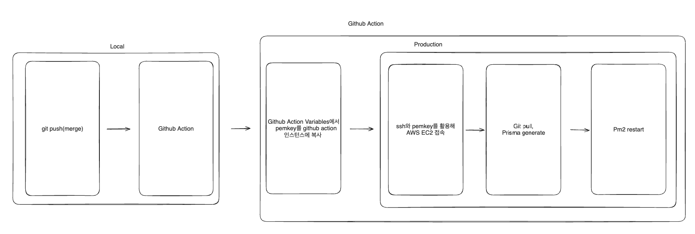

# Automate deployment

---

개발을 하다보니, 새로운 기능을 구현할때마다 ec2에 ssh접속해서 git pull당겨오고 서버를 재시작하는 절차가 너무 귀찮다고 느꼈다. 그래서 CI/CD까진 아니여도 배포 자동화를 구현하면 편하겠다 생각했고, 그래서 배포 자동화 과정에 대해 글을 작성해보려 한다.

### CI/CD란?


CI는 지속적 통합(Continuous Integration)개발자를 위해 빌드와 테스트를 자동화하는 과정이고,

CD는 지속적 제공(continuous delivery)이라는 의미와 지속적배포(continuous deployment)라는 의미를 모두 가지면서 최종적으로 프로덕션 환경에 자동으로 배포하는 역할을 한다. 

위의 과정을 모두 거친게 CI/CD라고 할 수 있고, 내가 CI/CD 환경을 구축하지 못한 이유는 CI부분과 같다. 사실 테스트코드가 아직 없고, 그냥 Github Action을 통한 리포지터리 자동 병합 및 프로덕션 환경에 자동으로 배포 과정만 있기 때문이다. 테스트코드가 있었으면 좋았겠지만,, 졸업작품의 특성상 시간에 쫓겨서 하는경우가 너무 많아 테스트코드까지는 짜지 못했다. ㅠ

### 배포 자동화 과정



위 사진과 같은 구성으로 진행된다. 

1. main branch에 merge되거나 main에서 git push한 경우, Github Action이 실행된다.
2. Github Action 인스턴스에서 미리 설정해둔 pemkey의 값과 ssh명령어로 production ec2에 접속한다.
3. git pull, npx prsima generate 명령어를 통해 배포서버의 코드 변경사항을 추가한다.
4. pm2에 watch옵션을 걸어둔 스크립트가 변경사항을 추적하고 서버를 재가동한다.

아래는 위의 과정을 실행하는 Github Action yml파일이다.

```yaml
name: Deploy to EC2

on:
  push:
    branches:
      - main

jobs:
  deploy:
    runs-on: ubuntu-latest

    steps:
      - name: Checkout repository
        uses: actions/checkout@v2

      - name: Install Node.js using nvm
        run: |
          export NVM_DIR="$HOME/.nvm"
          [ -s "$NVM_DIR/nvm.sh" ] && \. "$NVM_DIR/nvm.sh"  # This loads nvm
          nvm install 16.13.2

      - name: Install SSH key
        run: |
          mkdir -p ~/.ssh
          echo "${{ secrets.EC2_SSH_PRIVATE_KEY }}" > ~/.ssh/donga.pem
          chmod 600 ~/.ssh/donga.pem
          ssh-keyscan -t rsa github.com >> ~/.ssh/known_hosts
          ssh-keyscan -t rsa ec2-12-345-678-910.ap-northeast-2.compute.amazonaws.com >> ~/.ssh/known_hosts

      - name: SSH into EC2 and pull changes ssh 접속 + git pull
        run: |
          ssh -i ~/.ssh/donga.pem ubuntu@ec2-12-345-678-910.ap-northeast-2.compute.amazonaws.com "cd ~/server && git restore . && git pull origin main"

      - name: npm install 버전 동기화
        run: |
          npm install

      - name: prsima generate(mysql)
        run: |
          npm run generate:mysql

      - name: prsima generate(mongo)
        run: |
          npm run generate:mongo

```

진짜 정말 확실히 느낀게 있다. 배포 자동화를 구현하는데 계속 사소한 에러가 나기도 했고, 공부할 것도 있었다. 저 짧은 yml파일을 만들고 성공적으로 배포 자동화를 구축하는데 5시간정도는 걸린 거 같다. 

근데, 이 배포 자동화를 만든 후 절약한 시간은 5시간을 벌써 웃돈거같다. 프론트에서 로깅을 요청한 상황이 아니면 내가 ssh로 ec2를 접속하는 일도 없고, 여러모로 번거로운게 많이 줄어든 거 같다.

Back-End가 나 혼자임에도 불구하고 이런 시간 절약을 이뤄냈는데, 팀에서 배포 자동화를 구축하여 팀원들도 사용한다면 많은 시간을 절약할 수 있을거란 생각이 든다.

그리고 꼭 **배포 자동화 뿐 아닌 CI/CD**도 구축해보고 싶다.
