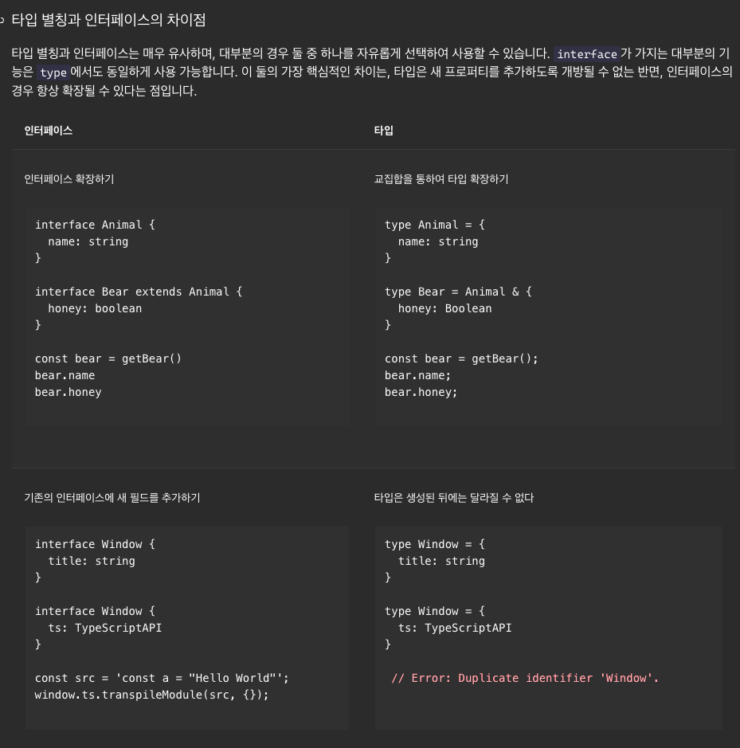

# Type VS Interface

---

# 🚂 Motivation

객체를 붕어빵이라고 표현하는 나 자신을 위해서 Typescript 공부…?

사실 객체를 공부했다기보단, 그냥 타입스크립트쓰다보니 궁금한 게 생겨서 찾아봤습니다.

# ⭐ What I Learned

TS는 컴파일이 진행되며 JS로 변환됩니다. 그 과정에서 JS가 구현하지 못하는 게 많습니다.

여기서는 크게 세가지를 다룹니다.
- Interface
- Type alias
- Generics
## Interface

### Typescript

```typescript
interface User {
  username: string;
  email: string;
};
const user: User = { username: 'Bob', email: 'bob@example.com' };
```

### Complied Javescript

```typescript
const user: User = { username: 'Bob', email: 'bob@example.com' };
```

Interface는 공식문서에서 가장 먼저 설명되는 Type 타입 선언의 가장 기본적인 방법입니다. 

의외로 기존의 OOP를 사용하는 언어들과는 달리, TS에서의 interface는 타입선언이 첫번째이고, extends나 implement를 사용해 확장성이나 클래스를 고려하는게 두번째로 설명하고 있습니다.

## Type alias

### Typescript

```typescript
type User = {
  username: string;
  email: string;
};
const user: User = { username: 'Bob', email: 'bob@example.com' };
```

### Complied Javescript

```typescript
const user = { username: 'Bob', email: 'bob@example.com' };
```

interface와 굉장히 유사하게 타입을 정의하고 있습니다. 하지만 Type alias가 타입에 한정에서는 더 유연하게 확장이 가능하고, 튜플타입도 지원합니다. 

```typescript
type ID = string | number; // 유니언 타입
type Point = [number, number]; // 튜플
```

## Generics

### Typescript

```typescript
function identity<T>(value: T): T {
  return value;
}
const result = identity<number>(42);
```

### Complied Javascript

```typescript
function identity(value) {
  return value;
}
const result = identity(42);
```

제네릭은 타입을 동적으로 지정할 수 있는 도구. 함수, 클래스, 인터페이스, 타입 등에 적용 가능합니다.
이는 타입을 유연하게 사용함으로써 코드의 재사율성을 많이 높일 수 있습니다.

이외에도 const enum, Type assertions, 추상 클래스에서의 타입 정보가 있습니다.

## Type alias VS Interface

사실 이게 오늘 공부의 목적이였습니다. 

물론, OOP에서의 Interface는 자주 사용했지만, Type을 선언함에 있어서도 Interface만을 사용했던 거라 궁금했는데, TS하는 분들이라면 의외로 둘의 차이를 염두하며 개발하지 않는 거 같습니다.

### 그래서 뭔데?

공식문서에서는 둘의 차이를 아래와 같이 설명합니다.

똑같이 사용하지만 문법이 다른 경우도 있고, 중복해서 선언이 가능한지 불가능한지(생성한 후 property를 조작하는 방법



그리고, Interface에선 아래와 같이 객체가 아닌 값은 타입 할당이 안됩니다.

```typescript
type Address = string; // 가능
interface Address { 
	address: string
} // 접근하려면 객체 방식이여야 함. 
const address: Address = "인천광역시 ..."
```

### 진짜 결론

TS 공식문서에서는 이 문제에 대해 한줄요약해줍니다.

`대부분의 경우 개인적 선호에 따라 인터페이스와 타입 중에서 선택할 수 있으며, 필요하다면 TypeScript가 다른 선택을 제안할 것입니다. 잘 모르겠다면, 우선 interface를 사용하고 이후 문제가 발생하였을 때 type을 사용하기 바랍니다.`

# 💭 Impression

OOP를 기반으로 한 언어들과 성격이 많이 갈린다고 느껴집니다.

공식문서에서 `우선 interface를 사용하고 이후 문제가 발생하였을 때 type을 사용하기 바랍니다.` 라고 말해주는 건 좀 놀랐습니다.

제가 생각하기에는 Type alias와 interface를 차이둬서 개발했을 때 더 좋은 가독성을 만들 수 있다고 생각하지만, 그게 자신이 없다면 interface를 위주로 사용하는 것이 좋겠네요.~~(일단 나부터~~)
